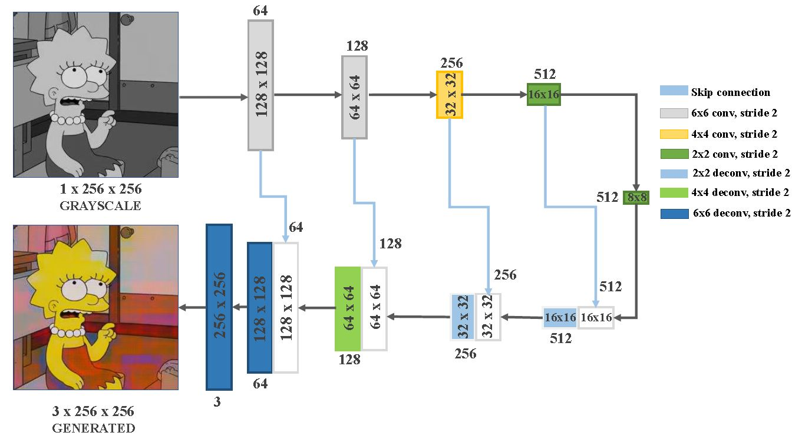
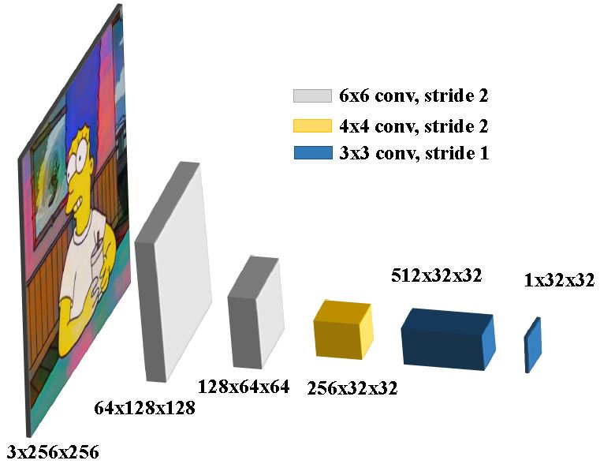

# The Simpsons Image Colorization using a Conditional Generative Adversarial Networks (cGANs) and a Markovian discriminator (PatchGAN)

## Table of Contents
Here the cGANs described in section 6.2 and used in Experiment 1 and partly in 2 and 3 can be found here:
[Network 1](https://github.com/alexandrahotti/Colorization-using-a-Conditional-GAN/tree/network_v1)
[Network 2](https://github.com/alexandrahotti/Colorization-using-a-Conditional-GAN/tree/network_v2)
[Network 3](https://github.com/alexandrahotti/Colorization-using-a-Conditional-GAN/tree/network_v3)

The architecture referred to as MIN-PatchGAN described in section 6.3, 4.3.2 and used in Experiment 4 can be found here:
[Min-PatchGAN](https://github.com/alexandrahotti/Colorization-using-a-Conditional-GAN/tree/network_v9)

The architecture referred to as Average-PatchGAN described in section 6.3, 4.3.1 and used in Experiment 3 and 4 can be found here:
[Avg-PatchGAN](https://github.com/alexandrahotti/Colorization-using-a-Conditional-GAN/tree/network_v10)

The code used to create the dataset can be found here:
[Bashscripts](https://github.com/alexandrahotti/Simpsons-Image-Colorization-using-cGAN-and-PatchGAN/tree/bashscripts)

The project report can be found here:
[Report](https://github.com/alexandrahotti/Simpsons-Image-Colorization-using-cGAN-and-PatchGAN/blob/master/DD2424_Simpsons_Image_Colorization_using_cGAN_and_PatchGAN_Alexandra_Hotti_Jacob_Malmberg_Marcus_Nystad_%C3%96hman.pdf)

The project powerpoint presentation can be found here:
[Powerpoint Presentation](https://github.com/alexandrahotti/Simpsons-Image-Colorization-using-cGAN-and-PatchGAN/blob/master/Simpsons%20Image%20Colorization%20using%20cGAN%20and%20PatchGAN.pptx)

## Results
Here some results from the two best performing networks can be found.

### Min-PatchGAN Network Results
Generated images using the Min-PatchGAN architecture described in sections 4.32 and 6.3 in our paper.

  
  
  
  
  
  
  

### Avg-PatchGAN-Network Results
Generated images using the Avg-PatchGAN architecture described in sections 4.31 and 6.3 in our paper.

  
  
  
  
  
  

### Ground Truth
The ground truth images corresponding to the colorized images above.

  
  
  
  
  
  

## Prerequisites
- Pytorch 1.1

### Dataset
The data consisted of 36 000 images split into a training, a validation and a test set. The test set contains 1 000 images,
the validation set contains 7 000 images, and the training set contains 28 000 images. The images were taken from season
10-27 of The Simpsons. From these episodes, one image was taken every 15 seconds, excluding the first and last minute to
avoid capturing the intro and outro multiple times. The images were down-sampled to a resolution of 256x256 and transformed
to gray scale using the imagemagick and ffmpeg software suites. Below an example of a ground truth color image and a gray scale image can be found.
 
 
      

## Network Architectures
The network architecture of the final best performing networks are depicted below.

Below is the architecture used for the generator in Average-PatchGAN (branch: network_v10), MIN-PatchGAN (branch: network_v9), cGAN (branch: network_v10).

  
  
  

This is the architecture used for the discriminator in MIN-PatchGAN (branch: network_v9) and Average-PatchGAN (branch: network_v10).

  
  

Below the architecture used in the discriminator for the cGAN that can be found in branch: network_v2.

  
  

