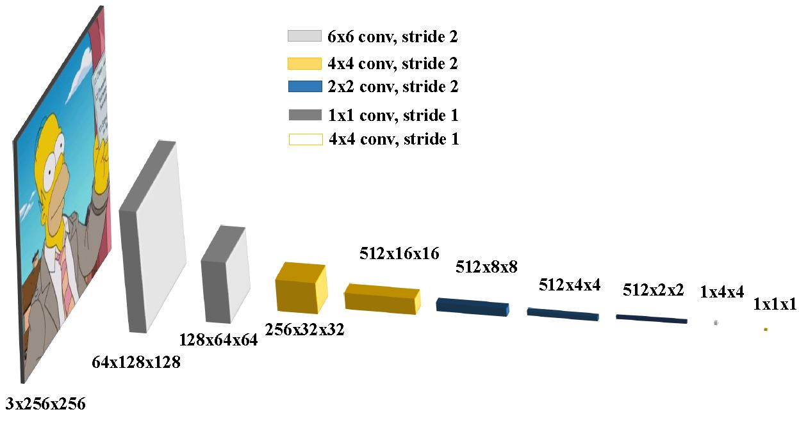

# The Simpsons Image Colorization using a Conditional Generative Adversarial Networks (cGANs) and a Markovian discriminator (PatchGAN)

## Results

### Softmin, Average PatchGAN Network Results

  

### Average PatchGAN Network Results

## Prerequisites
- Pytorch 1.1

### Dataset
The data consisted of 36 000 images split into a training, a validation and a test set. The test set contains 1 000 images,
the validation set contains 7 000 images, and the training set contains 28 000 images. The images were taken from season
10-27 of The Simpsons. From these episodes, one image was taken every 15 seconds, excluding the first and last minute to
avoid capturing the intro and outro multiple times. The images were down-sampled to a resolution of 256x256 and transformed
to gray scale using the imagemagick and ffmpeg software suites.

## Networks Architecture
The network architecture of the final best performing networks are depicted below.

Below is the architecture used for the generator in Average-PatchGAN (branch: network_v10), MIN-PatchGAN (branch: network_v9), cGAN (branch: network_v10).

  
  
  

  
  

  
  

